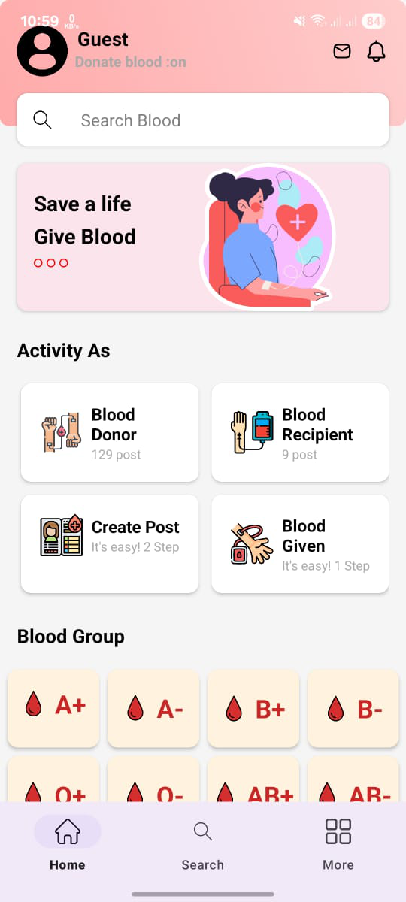
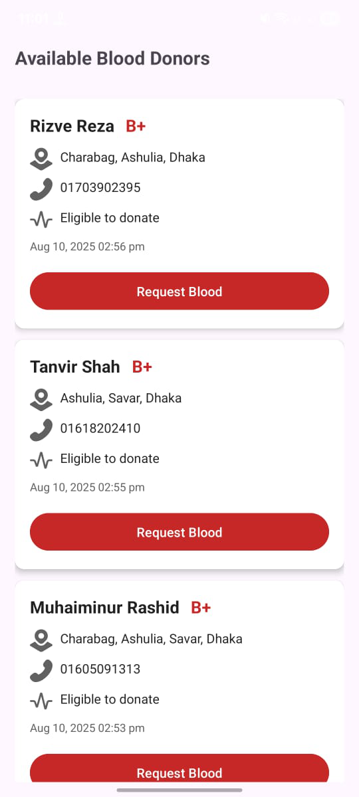
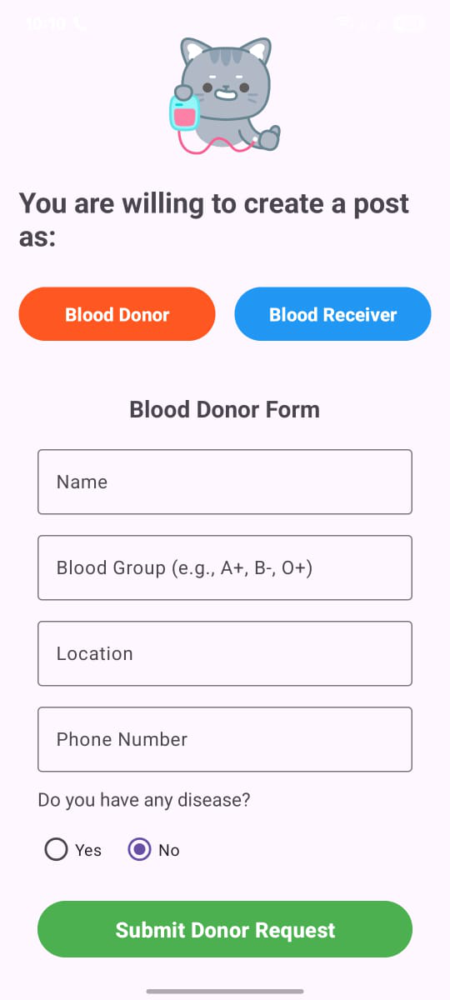

# ❤️ Smart BloodCare  

[]()
[]()
[]()
[]()

**Smart BloodCare** is a mobile application that connects **blood donors** with those in need, making blood donation **faster, easier, and smarter**.  
Developed as part of our **Java OOP project**, it demonstrates real-world application of **Object-Oriented Programming** principles.

---

## 🚀 Features  

- 🔍 **Search Donors** by blood group & location  
- 📢 **Post Blood Requests** instantly  
- 🩸 **Register as a Donor** with contact details  
- 📍 **Google Maps Integration** for nearby donors  
- 🔔 **Urgent Notifications** for blood requests  
- 💬 **In-App Messaging** between donors & recipients  

---

## 🛠️ Tech Stack  

| Technology     | Purpose |
|----------------|---------|
| **Java**       | Core app development |
| **Android Studio** | IDE for building & running the app |
| **Firebase Realtime Database** | Store donor & request data |
| **Firebase Authentication** | Secure login & registration |
| **Google Maps API** | Show donor locations |
| **Firebase Cloud Messaging** | Real-time notifications |

---

## 🎯 OOP Concepts in Action  

- **Encapsulation** – Secure handling of user data using getter/setter methods  
- **Inheritance** – Common logic & UI reused in multiple components  
- **Polymorphism** – Flexible method overriding for different roles  
- **Abstraction** – API handling via abstract helper classes  

---

## 📸 Screenshots  

| Home Screen | Donor List | Request Form |
|-------------|------------|--------------|
 |  |  |

---

## 👥 Team Members & Roles  

| Name                        | Role                              |
|-----------------------------|-----------------------------------|
| **Rizve**                   | 🖥️ Lead Developer                 |
| **Md. Ferdous Foysal Hridoy**   | 🎨 UI/UX Designer & Team Leader    |
| **Tanvir Shah**             | 📱 Android Developer              |
| **Muhaiminur Rashid**       | 📱 Android Developer              |
| **Sadia Akter**             | 🛡️ Software Quality Assurance (SQA)|

---

## 📦 Installation  

```bash
# Clone this repository
git clone https://github.com/kh_rizve/smart-bloodcare.git

# Open in Android Studio
# Connect Firebase to your project
# Add Google Maps API Key in AndroidManifest.xml
# Build and run
